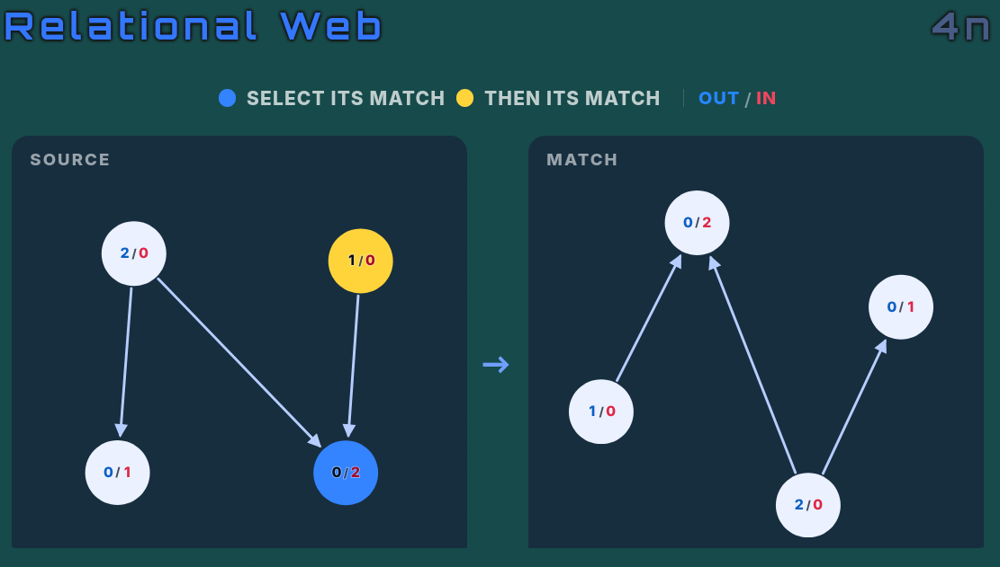
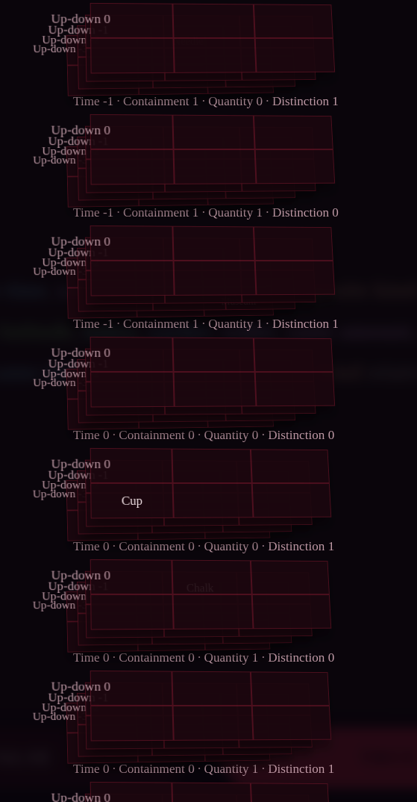

# 4 — Legibility

Four places where the information is correct and cannot be read. The favicon is
in here rather than in a section of its own because it is the same failure: the
right asset exists and the wrong one is what reaches the eye.

---

## 4.1 Relational Web

> The web's arrows can hardly be distinguished. The black of the A is also bad.
>
> A good example of this exercise is here: [shot 07]

| current | the reference |
|---|---|
|  |  |

The black node is a variable-name bug and is fixed in
[1.3](1-correctness.md#13-the-black-node-in-relational-web). The rest is design,
and the reference image is unusually useful because it is the same exercise
solved well — it is worth reading off what it does differently rather than
inventing improvements.

**What the reference does that the current drawing does not:**

- **Arrows are the brightest thing on the canvas.** Bright blue on deep navy.
  The current stroke is `var(--th-text-dim)` at 1.7
  ([`relational-web.component.css:10`](../src/app/syllogimous/components/relational-web/relational-web.component.css)) —
  the *dim* text colour, which is the colour chosen for things that should
  recede. The arrows are the premises here; nothing should be brighter.
- **Arrows are straight.** The current ones bow to avoid overlapping
  neighbours — `layoutArrows` in
  [`web.utils.ts:495`](../src/app/syllogimous/utils/web.utils.ts), and its
  comment explains at length why a fixed bow does not work. It is careful code
  solving the wrong problem: the crossings come from the circular node layout
  (`web.utils.ts:296`, every node on one circle at equal radius), and curving
  the edges is compensation for a layout that puts them in each other's way.
- **Nodes are opaque and light on dark.** The current node is
  `color-mix(--th-panel 85%, transparent)` — a translucent panel colour, so an
  arrow passing behind a node shows through it and reads as passing *into* it.
- **Nodes are labelled by their degree signature**, `out/in`, not by an
  arbitrary letter. This is the largest difference and it is not cosmetic: it
  turns "compare two pictures" into "match the 2/0 to the 2/0", which is what
  makes the reference readable at a glance. It also changes the exercise, so it
  is a choice rather than a fix — see below.
- **A legend states the task**, in the picture, every time.

**Done:**

1. **Arrows in the foreground colour, at 2.2.** They were `--th-text-dim` — the
   colour reserved for what should recede — at 1.7, in a picture whose entire
   content is which way each arrow runs. Heads and self-loops with them.
2. **Opaque nodes.** They were the panel colour at 85%, and the missing 15% was
   enough for a shaft to show through a circle, which in this mode is not a
   cosmetic difference.
3. **`clearestScatter`: the clearest of eighty scatters.** Measured over real
   generated webs, about **18%** of drawn arrows passed under a node that was
   neither of their ends — an arrow that does that reads as ending there. Now
   about **3%**. Zero is not reachable: a dense web on twelve nodes has no
   arrangement in which no arrow passes near any node.

**5. Ports: each arrow gets its own point on the node's rim.** The reported
picture still had arrows arriving bundled, and bowing structurally cannot fix
that — a bow bends the *middle* of a curve and leaves both ends exactly where
they were, so a fan of arrows converging on one node stayed a fan converging on
one point however hard it was bent. `layoutArrows` even made it worse by
excusing the crowding from measurement: for edges sharing a node it skipped
eight of twenty-five samples at each end, on the reasoning that they must meet
there anyway — so the one region where the crowding showed was the one region
no candidate was scored on.

They must meet at the node. They need not *approach* along the same line.
`portsFor` gives every incident arrow its own bearing on the rim, at least 45°
from its neighbours. Same-node pairs passing within six units of each other:
**17.7% → 3.3%**, median clearance 13.9 → 23.3. 45° was measured against 60°,
72° and 90°, and is also the one that leaves an arrow pointing nearest to where
it is going.

**The first version of the spread handed the answer over, and the test caught
it.** Walking the sorted bearings and pushing each one to at least the minimum
past the last separates them perfectly well — and turns a crowded node into a
comb of exact minimums whose shape depends only on *how many arrows the node
has*. Isomorphic webs have equal degree at matched nodes, so they grew
identical fans: 28% of matched nodes were drawn the same, and a reader could
have paired them off without following a single arrow. In a mode whose entire
question is whether two webs are the same shape, that is not a legibility bug,
it is the answer printed on the page.

The slack is now shared out **in proportion to the natural gaps**: each gap gets
the minimum plus its share of what the circle has left over. It fits exactly,
clears the minimum everywhere, and leaves a lopsided node looking lopsided —
which is scatter, not structure. The ordering is therefore driven by the
drawing and never by the graph, which is the property the mode rests on and now
has a test of its own.

**Item 3 of the original plan was wrong, and is not done.** It said to replace
the scatter with a layered layout, sources at the top and sinks at the bottom.
`scatterLayout`'s own comment explains why that undercuts the mode: a ring made
a rotational symmetry visible *as a turn of the picture*, and a force-directed
layout settles into regular arrangements — both hand over structure the mode
exists to make you derive from the arrows. A layered layout does it worse than
either, since ranking the nodes by depth is most of the answer drawn on the
page. The bowing stays for the same reason it was written: it separates
near-parallel edges leaving one node, which is a different problem from
crossings and is already solved.

`clearestScatter` respects that reasoning rather than working around it. The
scatters are still structure-blind and still random; it only chooses among
them, on a measure about *arrows and nodes* rather than about structure, so
every arrangement it can produce is one the sampler could have produced first
time.

4. **Degree labels stay a rung, unbuilt.** The reference's `out/in` labelling
   makes the exercise easier by design, and the roadmap already treats "no
   counting arrows" as a rung (`structural`), so they belong at the bottom of
   that ladder rather than replacing the letters.

**Verification.** Appearance is checked by eye, but two of the causes are not
appearance and are now tested: no two nodes drawn closer than the node diameter,
and the obstructed-arrow rate, with the bar set at 6% so a regression shows
rather than at wherever the number happens to sit today.

---

## 4.2 The composed-space explanation diagram — **BUILT**

**It was never only the 6-D one.** The author's read is right: the grid draws
the fourth axis and beyond as *slices* — one small picture per combination of
the remaining axes — so it is a Cartesian product and it fails from four axes
up. Four is a row of stacked-plane scenes, five is sixteen of them, six is the
screenshot. Fixing the label collisions would have produced a legible version of
a picture that should not be drawn.

Above three axes `buildQuestionMap` now returns a **table** instead: one row per
object, one column per axis, coordinates relative to the object the frame is
pinned to, columns painted with the same per-axis colours the premises use.
`slices` is empty when `table` is set — a screen showing a table *and* thirty
unreadable grids has replaced nothing.

**Three and under keep the grid**, because three is where the axes can still be
seen: two as a grid and the third as stacked planes, which is v3's drawing and
works.

The frame is named and comes first. Coordinates are relative because that is all
the premises determine — they chain offsets, so the arrangement is fixed only up
to where the chain is pinned, which is what Transformation's derivation already
says and records why it is safe.

**Still to do:** marking the axis the conclusion asks about, which the sketch
below has and the built version does not.

### The original diagnosis



> This is an explanation for 6D I think, yeah you can barely distinguish
> anything.

At six dimensions the diagram renders as a vertical stack of small 2-D grids,
one per combination of the remaining four axes, each captioned
`Time -1 · Containment 1 · Quantity 0 · Distinction 1`. The axis label "Up-down"
is drawn four times per panel, overlapping itself. The object names are the same
colour as the grid lines. There are thirty-odd panels.

The approach does not fail at 6-D because of a rendering bug. It fails because
**small multiples over four free axes is sixteen panels minimum and grows by a
factor of two or three per axis**, and the reader has to find the one panel that
matters before reading anything. Fixing the label collisions would produce a
legible version of a diagram that should not be drawn.

**What to draw instead.** Above three axes, the honest picture is a table, not a
space:

```
             E-W    N-S    U-D    Time   Size   Amount
  Cup         -2     +1      0      -1     +1      0
  Chalk        0      0      0       0      0      0     ← origin
  Needle       0      0     -1      -1     +2      0
  Museum      +1     -1     -1       0     +2     +1
                                    ▲
                    the axis the conclusion is about
```

One row per object, one column per axis, coordinates relative to whichever
object the premises pin the frame to — Transformation's derivation already
states coordinates relative to the first object for exactly this reason, and
records why it is safe to do so. Columns painted with the same per-axis colours
the premises use, so the table and the sentences agree. The axis the conclusion
asks about is marked.

This is readable at any dimensionality, which the grid is not, and it is what a
person reconstructs on paper when they get one of these wrong.
`wordCoordMap` and `axisNames` are already on the `Question` and hold precisely
this data — the comment on `wordCoordMap` says it is kept *"so the item can be
drawn afterwards"*.

**Keep the grid for two and three axes**, where it is genuinely better than a
table and where it currently works. The switch is on axis count.

**Fix the label repetition regardless.** Whatever is drawing "Up-down" once per
grid row rather than once per grid is a bug in its own right and will show up in
the 3-D case too.

---

## 4.3 Negation is the least legible thing on the card

Not in the source list — an observation from reading the stylesheet, visible in
[shot 14](shots/14-syllogism-two-negatives.png) and
[shot 13](shots/13-unreferenced-object.png). It is *not* what those screenshots
were reported for; that is
[3.3](3-explanations.md#33-the-syllogism-derivation-reads-as-a-chain).

```css
/* card.component.scss:27 */
.is-negated { color: var(--negated-color); font-style: italic; }
```

```css
/* styles.css:5 */
--negated-color: rgb(128, 0, 0);
```

Dark maroon, italic. On the dark red-black panel these themes use, the `No` in
*"**No** Swimmer is Fisherman"* and the `is not` in *"Some Zipper **is not**
Swimmer"* are the dimmest glyphs in the sentence — and they are the glyphs that
invert its meaning. Every other word is bright.

The cause is that `--negated-color` is the one premise colour that never went
through ThemeService. Everything else is resolved per theme against the measured
panel luminance
([`theme.service.ts:337`](../src/app/syllogimous/services/theme.service.ts));
this is a hard-coded constant in `styles.css` that happens to work on a light
background.

**Fix.** Move it into the theme's resolved variables with the others, derived
from the panel luminance like the dimension palette is. Keep the italic — the
shape cue is good and works independently of colour — and make the colour
prominent rather than recessive. A reversal cue is not a footnote.

This is also worth a check in `tests/display.test.ts`, which already exercises
theme resolution: every colour the card assigns to premise text must clear a
contrast ratio against the resolved panel colour.

---

## 4.4 The icon

> Another issue is that the website icon sometimes resembles the old SYL instead
> of the new triangle.

Confirmed, and it is not intermittent — it is which icon the browser happens to
pick.

`src/assets/favicon.svg` was updated to the new triangle. Every other icon in
`src/` is the old **SYL** wordmark, untouched since the initial import:

```
src/favicon.ico              src/favicon-16x16.png     src/favicon-32x32.png
src/apple-touch-icon.png     src/android-chrome-192x192.png
src/android-chrome-512x512.png
```

All six are declared in `src/index.html:38-44` alongside the SVG. Which one is
used depends on the browser, the surface (tab, bookmark, home screen, PWA
install), and the cache — hence "sometimes".

**Fix.** Regenerate all six from `assets/favicon.svg` at their declared sizes.
Nothing else changes: `index.html` and `angular.json`'s asset list are already
correct and complete.

**Then check `docs/`.** The published build carries its own copies
(`docs/favicon.ico`, `docs/android-chrome-*.png`, …) which are the ones actually
served from Pages, and a rebuild is what replaces them. A stale icon in `docs/`
would keep the old mark live regardless of what `src/` holds.
