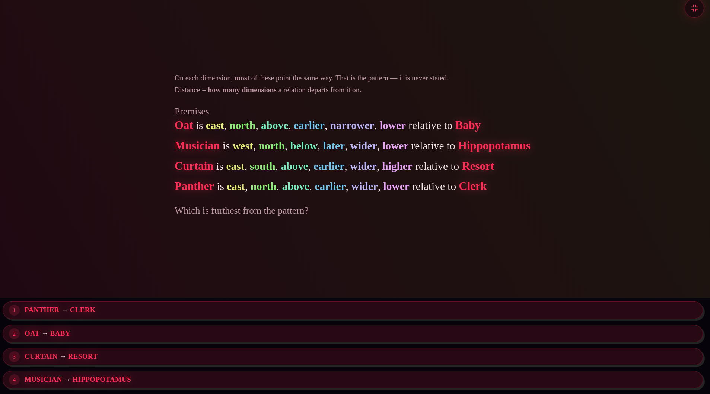

# 5 — Mode reworks

Two modes the author asks to have rebuilt rather than adjusted. Both are larger
and less determined than anything else in this plan, and Oddest Relation needs a
decision before code.

Do these last. Both are self-contained — nothing in sections 1–4 depends on
them — and both will be easier once `derivationDepth` from
[section 2](2-conclusion-depth.md) exists, because the difficulty of the
replacements is exactly the thing that is hard to judge by eye.

---

## 5.1 Transformation Matching

> I really dislike this type of puzzle even just the display and it's so
> obvious, I think this is transformation matching or something but it needs to
> be reworked completely.

[`generators/transform-match.ts`](../src/app/syllogimous/generators/transform-match.ts),
485 lines, drawn by the `grids` renderer.

### What is wrong with it

**Two points on a 6×2 grid is not a puzzle.** `Pillow` does not move; `Swamp`
moves one square east. Reading the answer takes one saccade. The mode's own
justification — *"you cannot see a rotation in a column of numbers, which is
precisely the thing the mode asks you to spot"* — is sound, and undermined by
giving the eye two points and one row of freedom.

**The distractors give it away.** *1 west and 1 north*, *1 east*, *2 west*,
*2 south*. Only one option is a single-axis eastward move, and only one is
consistent with `Pillow` staying inside the frame. Both filters are applied
before looking at the grids at all.

**The layout wastes the screen.** Two small grids in the middle of a 1920×1080
canvas, roughly 800 vertical pixels empty, options pinned to the bottom edge far
from the thing they describe. Whatever else changes, this should not survive.

### The rework

**More points, and enough of them that the transformation must be inferred
rather than seen.** Five or six, on a grid tall enough to have two free axes.
With two points, one correspondence is forced; with six, the reader has to find
which arrangement is preserved.

**Transformations beyond translation.** Rotation, reflection and glide are the
interesting cases and are precisely the ones a coordinate list hides. A
translation-only mode is a subtraction problem drawn as a picture. The
`transformations.utils.ts` library already implements rotations and reflections
for the composed spaces — this is composition, not new geometry.

**Distractors that are near-misses.** Each wrong option should agree with the
correct one on some of the points, so eliminating it requires checking a point
rather than checking the frame. A wrong option that no point supports is not a
distractor. Concretely: generate candidates by perturbing the true
transformation, then reject any candidate that can be ruled out from fewer than
two points.

**Options as grids, not as sentences.** `choiceGrids` already exists on
`Question` and is documented as *"options that are themselves arrangements,
drawn on the same frame"* — the mode has the capability and this item did not
use it. Naming the transformation in words invites solving the words.

**Fill the frame.** Grids centred and sized to the available height, options
beside or beneath them at the same scale.

### Verification

Two properties, both of which this item fails:

- **No option is eliminable without reading the grids.** Formally: for each
  wrong option, at least one point's before-position is consistent with it.
- **No single point determines the answer.** For every point, at least two
  options move it identically.

---

## 5.2 Oddest Relation

> I don't like the oddest out how it's currently done, it should be groups and
> you identify the group that has the dimension with the highest difference
> between members at the edges of it.

[`generators/oddest-relation.ts`](../src/app/syllogimous/generators/oddest-relation.ts),
333 lines.

### What it does now

Four relations, each stating six axes. On each axis independently, whichever
direction the majority of relations use is "the pattern"; distance is the count
of axes on which a relation departs from it; the answer is the relation with the
largest count. The rule is stated in the setup line — *"On each dimension,
**most** of these point the same way"* — so nothing has to be inferred, only
counted.

It is arithmetic with reading attached. Six axes × four relations is
twenty-four comparisons, done in a fixed order, with no point at which a
decision is made. Difficulty scales with axis count and never with structure,
which is the thing the roadmap's own ground rule warns against: *difficulty is
structure, not length.*

### What the author is asking for

The sentence describes a different exercise, and the reading that makes it
coherent is:

- The items are partitioned into **groups**.
- Within a group, on each dimension, the members can be laid out along that
  dimension; the group's **spread on that dimension** is the difference between
  its extreme members — its edges.
- Each group's score is its widest dimension.
- The answer is the group with the largest such spread.

That is a genuinely different task from the current one. It requires ordering
members within a group, finding each group's extremes per dimension, and
comparing across groups — three nested steps with real decisions, where the
current mode has one flat count. And it does not decompose into
independent-per-axis arithmetic, because the *widest* dimension has to be found
before groups can be compared.

**Confirmed by the author.** This reading — per-dimension spread between a
group's edge members, the group scored by its widest dimension — is the one to
build. The alternative reading, the group containing the single widest-spread
*pair* regardless of dimension, is not it.

### If the reading holds

**Build it as a new mode, not as a rewrite.** The existing generator keeps
working, keeps its ability history, and the new one enters through the
five-registry checklist in [ROADMAP.md](../ROADMAP.md). The author dislikes the
current mode, which is a reason to stop serving it by default — a settings
change — not a reason to delete an ability estimate that took a hundred answers
to build.

**Present the groups, not sentences.** A group of five items differing on six
dimensions is a table; six clauses per line per member is the display problem
from [4.2](4-legibility.md#42-the-composed-space-explanation-diagram) again,
one mode over.

**Existing pieces that carry over.** `buckets` on `Question` already holds group
membership and is documented for exactly this. The per-axis spread measurement
already exists in the Customise spread control
([`mode-modifiers.component.ts`](../src/app/syllogimous/components/mode-modifiers/mode-modifiers.component.ts)),
which is scoped per axis for the same reason this mode needs it — *"spread is
not one quantity: a long time axis is a different demand from a tall vertical
one"*.

**The generator must control the margin.** The gap between the widest group and
the runner-up is the item's difficulty, and left to chance it will usually be
large enough to see. Draw the intended margin first and search for a
configuration with it — the same inversion the hierarchy generator uses to keep
its answer distribution honest.

### Verification

- The intended answer is the unique maximum. Ties are unanswerable and must be
  rejected at generation, not broken arbitrarily.
- Over 150 items, the margin distribution matches what was asked for, rather
  than whatever a uniform draw produces.
- A solver reading only the rendered table re-derives the answer. Standard for
  this codebase and non-negotiable for a new mode.
